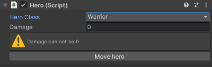

<h5 align="center">
  <br>
  <b>Custom Editor GUIs</b> 🪛
</h5>
<p align="center">
  
</p>

## :eyes: Overview 
<div>
  
  
</div>

## :open_book: About 
Simple project to play a bit with custom editors in Unity.

## :bricks: This project was built with: 
- [Unity](https://unity.com/)
- [C#](https://docs.microsoft.com/en-us/dotnet/csharp/)

## :running_man: Installing and Running  
 1. Clone this repository `git clone https://github.com/pferreirafabricio/unity-custom-editor.git`;
 2. Open `unity-custom-editor` folder with Unity and be happy 😄
 
## :recycle: Contribute
 1. Fork this repository;
 2. Create a branch with your feature: ```git checkout -b my-feature```
 3. Commit your changes: ```git commit -m 'feat: My new feature'```
 4. Push your branch: ```git push origin my-feature```
 
## :page_with_curl:	License
This project is under the MIT license. Take a look at the [LICENSE](LICENSE.md) file for more details.
